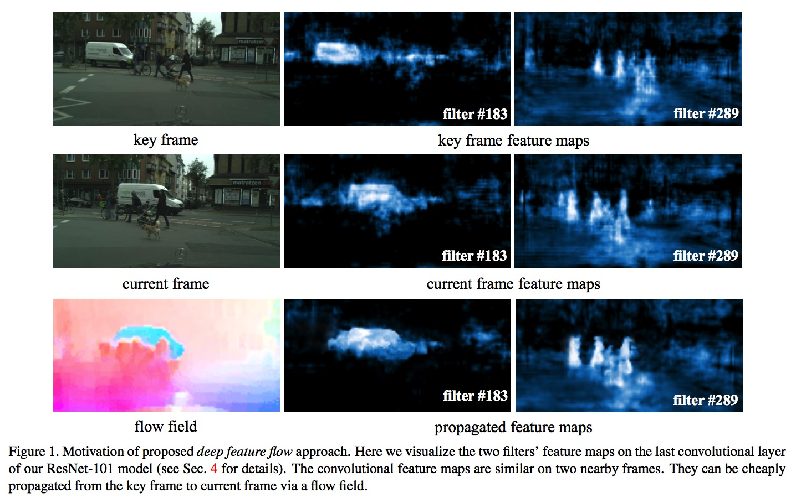
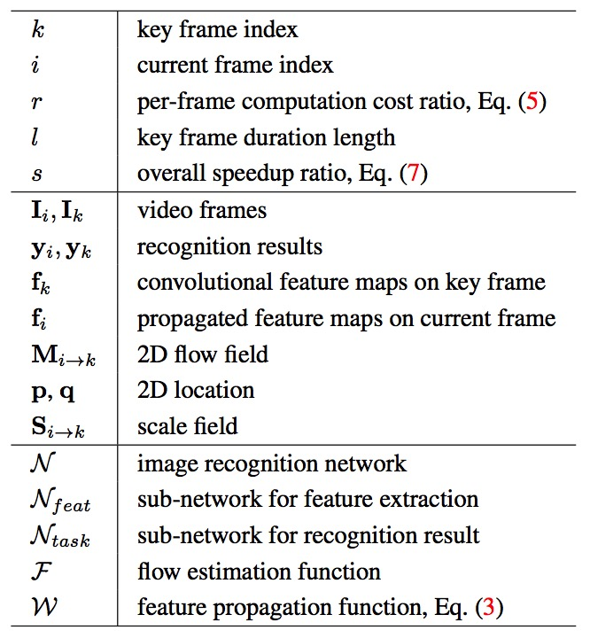
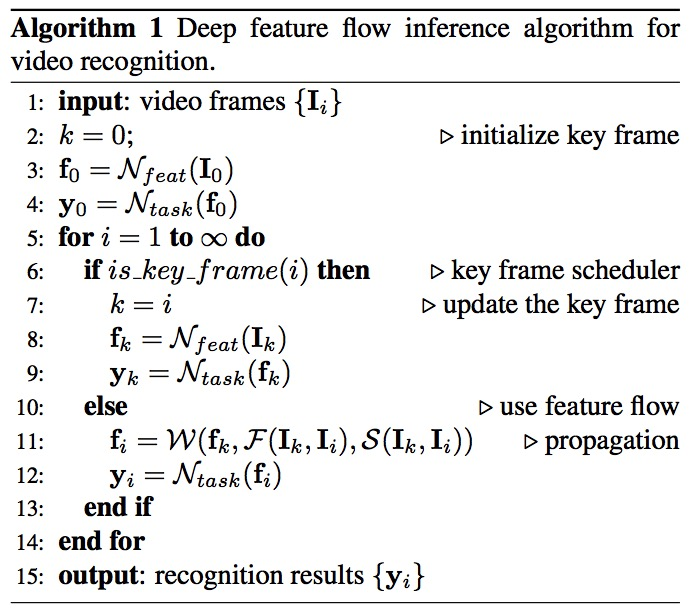
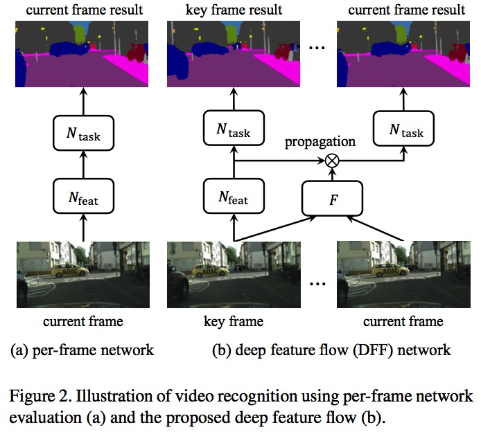

## Deep Feature Flow for Video Recognition

## 一、引言

深度卷积神经网络在图像识别任务上取得巨大成功。然而在视频任务上对单帧进行检测太慢。

因此，论文中提出深度特征流（Deep Feature Flow）框架用于快速精确的视频识别。该框架仅在稀疏关键帧上运行卷积网络的子网络，并通过流场（flow field）将关键帧的特征传递到其他帧。

因为流场计算和特征传播比计算卷积特征快很多，所以可以显著提升速度。整个架构采用端到端的训练，识别精度显著提升。

论文声称是第一次在深度学习框架中联合训练流和视频识别任务。与单帧方法比，实现了巨大的提升（10X），精度稍有损失。

## 二、相关工作

图像识别

- 目标检测：基于区域方法（R-CNN, Fast R-CNN, SPP-Net, Faster R-CNN, R-FCN）
- 语义分割：全卷积神经网络（FCN）

- 对每一帧都运用这些网络，计算开销太大。

网络加速

- 矩阵分解：将大的网络layers分解层多个小layers
- 量化网络权重

光流

- 光流主要针对小偏移量，目前一些针对大偏移和组合匹配的方法（DeepFlow和EpicFlow），但是都是手工设计。
- FlowNet第一次应用CNN直接估计运动，取得了不错的结果。最近的金字塔网络简化了架构。
- 论文中开发光流用于加速一般的视频识别任务。

视频识别中的开发时序信息

- T-CNN在视频的tubelets中融合时序和上下文信息。
- 密集3D CRF提出大范围的时空归一化进行语义视频分割。
- STFCN考虑用于视频语义分割的空间-时间FCN。
- 上诉工作能够提升精度但同时极大的增加计算开销。
- 本论文方法旨在通过利用视频上的时间连贯性来减少计算量。

缓慢特征分析

- 在视频中，图像的高级语义特征一般比低级语义特征变化更慢，因此在连续视频帧上，深度特征变化的缓慢且连续。
- 该特点已经被用于视频特征学习的调整中。本文也可因此受益。

Clockwork卷积网络

- 该工作与本论文最接近，在某些视频帧上禁用网络中的某些层，并重复使用之前的特征。该方法减少了一些帧中一些层的计算（如1/3或2/3）。
- 本文的工作减少大部分帧的大部分层的计算（如9/10）。
- Clockwork并没有考利用帧之间的关系，并简单地复制特征。它只重新编排现成网络中的推理计算，并未执行微调或重新训练。较小的速度提升却带来了较大的精度损失。
- 本文重新训练了一个两帧网络，其运动被认为是端到端的。在速度提升3倍的情况下仅带来很小的精度下降。

## 三、DFF（Deep Feature Flow）

### 推理

对于给定的前馈神经网络N ，I为图像输入，输出结果为y=N(I)

这里将N分解为两个连续的子网络:

- 第一个子网络：$N_{feat}$，被称为特征网络，该网络是全卷积且输出一些中间特征图，$f=N_{feat}(I)$。
- 第二个子网络：$N_{task}$，被称为任务网络，具有特定的任务结构，并在特征图上执行识别任务，$y=N_{task}(f)$。

连续的视频帧具有高度的相似性，且越深的特征层相似性越高，我们通过该相似性减少计算开销。具体的，$N_{feat}$ 仅运行在特定稀疏关键帧上，非关键帧 $I_{i}$ 的特征通过其之前的关键帧 $I_{k}$ 传播得到。

$M_{i \rightarrow k}$ 是一个二维的流场，其通过一个流估计算法 F 得到。然后通过双线性缩放到与用于传播的特征图相同的大小。当前帧 i 的位置 p 通过流场得到其与关键帧 k 的位置偏差得到，偏差 $\delta p=M_{i \rightarrow k}(p)$。

因此特征扭曲可以通过双线性差值得到：

$f^c_i(p)=∑_qG(q,p+δp)f^c_k(q)$			(1)

c表示特征通道，q是特征图的所有空间位置，G(·,·)为双线性差值核，是二维的，因此将其分解为两个一维核：

$G(q,p+δp)=g(q_x,p_x+δp_x)⋅g(q_y,p_y+δp_y)$		(2)

$g(a,b)=max(0,1−|a−b|)$

空间扭曲可能由于流估计错误导致不准确。为了更好估计特征，其强度通过尺度场（scale field）进行调节。尺度场通过尺度函数 S 得到 $Si→k=S(I_k,I_i)$。最后，特征传播方程定义为：

$f_i=W(f_k,M_{i\rightarrow k},S_{i \rightarrow k})$		(3)

该函数对所有位置、所有通道的特征进行处理，并对特征乘以尺度因子。

该视频识别算法被称为深度特征流。F 流场函数是手工设计的低级别流，如SIFT-Flow，不需要训练，马上可用。尺度函数 S 的每个位置为1。

### 训练

流函数最初用于获得低级图像像素的相关性，推理很快，但是对于识别任务不够准确，并且高级特征图的改变通常比像素慢。

为了对这些变量建模，这里提出使用一个CNN来估计流场和尺度场，这样所有的组件都能够端到端训练。

使用SGD训练，在每个mini-batch，随机选择一对邻近帧，$\{I _k,I_ i\}, 0\le i-k \le 9$。

- 前向传播时，特征网络 $N_{feat}$ 对关键帧图像 $I_k$ 计算得到特征图 $f_k$。
- 然后在帧  $I_k, I_i$ 上运行流网络 F，来计算流场和尺度场。当 i > k时，根据公式（3）特征 $f_k$ 传播至 $f_i$，否则不传播。最后，任务网络，否则不传播。
- 最后，在特征图 $f_i$ 上应用任务网络 $N_ {task}$ 生成结果，并产生损失值。反向传播损失到所以组件。可以发现，当 $i=k$ 时退化为每帧训练。

流网络比特征网络快得多。

公式（3）中特征传播函数是无参且完全可微的，我们计算特征 $f_i$ 中关于特征 $f_k$ 的导数，尺度场 $S_{i\rightarrow j}$，流场 $M_{i\rightarrow j}$。前两个使用链式法则容易计算。对于后一个，导数为：

$\frac{\partial f_i^c(p)}{\partial M_{i\rightarrow j}}=S^c_{i\rightarrow j}(p)\sum_q \frac{\partial G(q,p+\delta p)}{\partial \delta p}f _ k^c(q)$		（4） 

Pre-frame训练方法只能使用已标注的帧，而DFF可以使用所有帧，只要帧 $I_i$是已标注的。 

### 复杂度计算

非关键帧计算开销与每帧计算开销的比例：

$r=\frac{O(F)+O(S)+O(W)+O(N_{task})}{O(N_{feat})+O(N _ {task})}$		（5）

$N_{task}$ 的复杂度通常很小，$N_{feat}$和 F 的复杂度较高：

$O(N_{task})  << O(N_{teat})$

$O(N_{task})  << O(F)$

因为W和S非常简单

$O(W) << O(F)$

$O(S) << O(F)$

所以公式（5）中的比率：

$r ≈ \frac{O(F)}{O(N_feat)}$		 (6)

因此复杂度比例由流网络和特征网络决定。

另外，速度还跟关键帧的稀疏程度相关，如果定义每 $l$ 连续帧选一个关键帧，则加速因子为：

$s = \frac{l}{1+(l−1)∗r}$		（7）

### 关键帧安排

在本文中，采用的是简单的固定关键帧的安排，关键帧的应用区间 $l$ 固定，比较容易实施和调整。

然而根据图像内容的变化可能变化的 $l$ 能够实现更好的精度和速度的权衡。理想情况下，关键帧应该是图像内容具有显著变化时。

如何设计高效和调整关键帧的安排是后续需要改进的工作。不同的视频任务可能有不同的行为和需求。从数据中学习自适应关键帧的是一个更有吸引力的选择。

## 网络架构

1、流网络

我们采用基于CNN的 FlowNet 作为默认方法，并设计了两个低复杂度变体 

- FlowNet Half，每层减少一半的卷积核，复杂度为1/4
- Inception 结构的FlowNet Inception，复杂度减少为1/8

三个网络都在相同的数据集上预训练，输出的stride为4。输入图像缩小一半，因此流网络的输出是原图的1/8。

特征图的stride是16，使用双线性差值将流场降采样，双线性差值为网络的中的非参数层，且可微。

2、特征网络

- 使用ResNet作为特征网络，ResNet-50和ResNet-101默认为ImageNet分类预训练模型，丢弃最后一层1000路分类层，特征stride从32减少为16得到分辨率更高的特征图。
- 后面接DeepLab用于语义分割和R-FCN用于物体检测。
- conv5层的第一个block，其stride从2变为1。holing算法应用于 conv5 中所有 3*3 卷积核，以保持视野（dilation=2）。随机初始化的3×3卷积被附加到 conv5 以将特征通道维度减小到1024，holing算法也被应用（dilation=6）。该1024维的特征图作为后续任务的中间特征图。

3、语义分割

- 在中间特征图上应用随机初始化的1×1卷积层以产生（C + 1）得分图，其中C是类别的数量，1是用于背景类别。
- 之后跟一个softmax层输出每个像素的概率。因此任务网络仅有一个可学习的权重层，整体的网络类似于具有大视野的DeepLab。

4、物体检测

采用R-FCN。对于中间特征图，两个全卷积网络分别应用于前512维特征和后512维特征，分别用于区域推荐（region proposal）任务和检测任务。

区域推荐分支，使用RPN。使用 n=9 个anchors，两个并排的1x1的卷积层得到2n维的物体得分和4n的回归值。对每个图像应用NMS（0.7）后得到300个ROI。

检测分支，两个并排的1x1卷积层输出位置敏感的得分图和bbox回归图。他们的维度是 $(C+1)k^2$ 和 $4k^2$，k是检测器/回归器数量。最后使用NMS（0.3）得到结果。

## 实验

在两个数据集上进行评测

- Cityscapes：用于语义分割
- ImageNet VID：用于物体检测

方法和结果详见原论文。

效果：https://www.youtube.com/watch?v=J0rMHE6ehGw

## 未来工作

- 联合学习对于流场质量的影响，当前由于缺少gt数据无法评估。
- 目前的光流工作受限于合成数据或小的真实数据，对深度学习来说还不够。
- 流场估计和关键帧安排的改进可以使本文工作受益。
- 本文采用FlowNet主要原因是可选择的方法很少。设计更快更精确的流场网络在未来值得研究。
- 对于关键帧的安排，好的方法能够同时显著提升精度和速度。